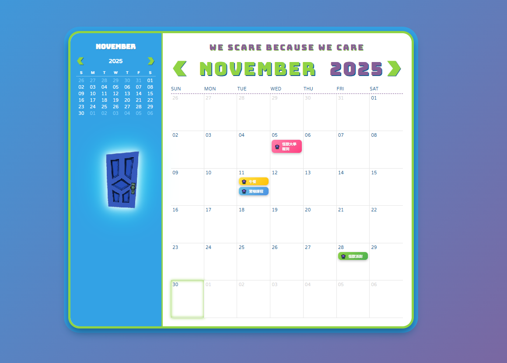
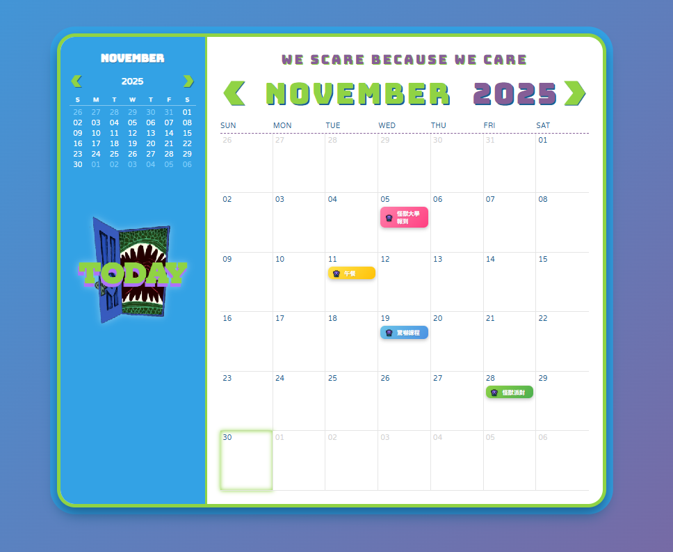
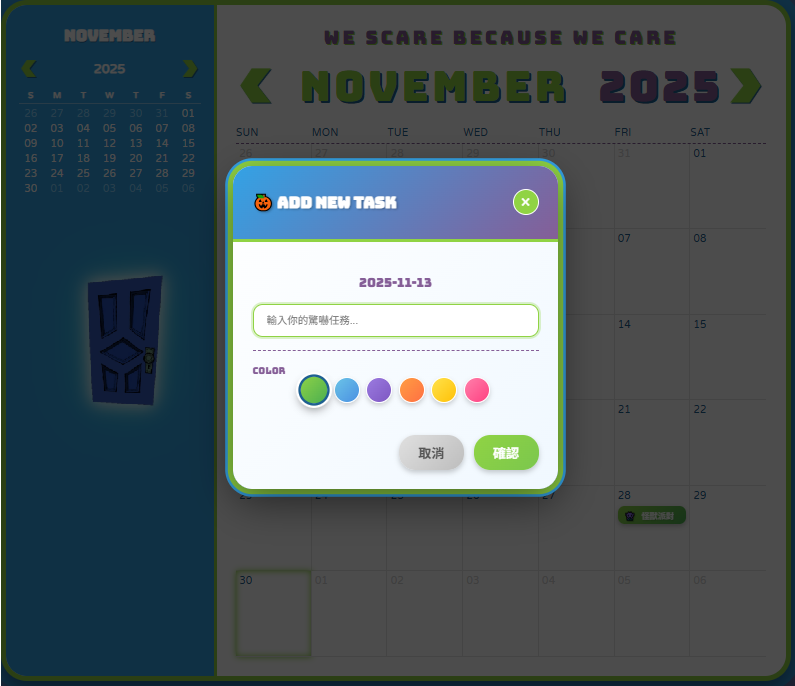
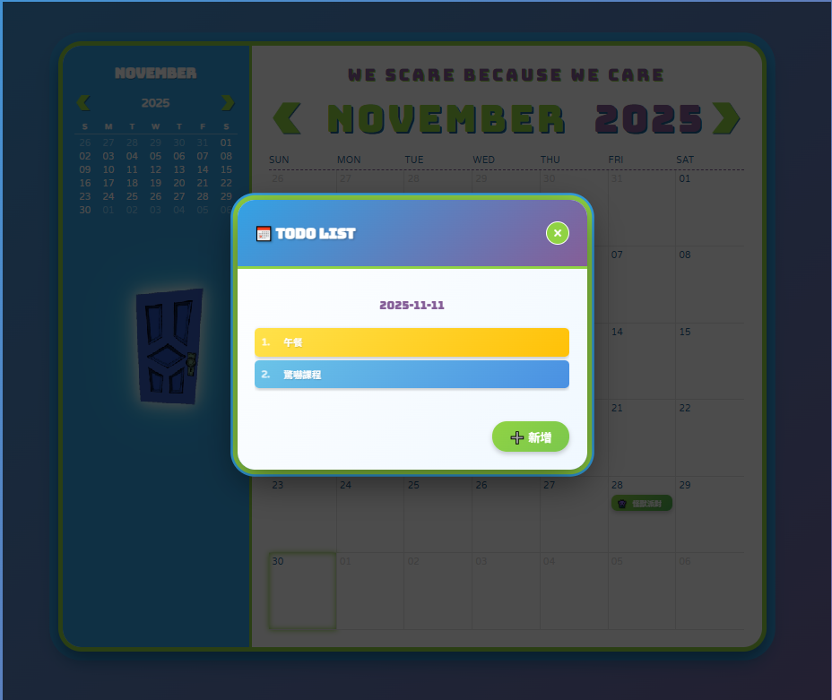

# 怪獸電力公司萬年曆  
**Monsters, Inc. Calendar**  
 <!-- 之後放一張截圖最棒！ -->

> **「WE SCARE BECAUSE WE CARE」**  
> 毛怪與大眼仔陪你把每一天都過得驚喜滿滿！

一個充滿怪獸大學風格、功能完整又超療癒的純前端萬年曆  
完全用 HTML + CSS + JavaScript（無後端、無框架）就能跑！

---

### 功能一覽（超強大！）

| 功能                     | 說明                                                                 |
|--------------------------|----------------------------------------------------------------------|
| 經典「怪獸之門」按鈕     | 滑鼠移上去會閃爍發光 → hover 會開門！點擊立刻回到今天 |
| 單擊 / 雙擊智慧互動      | 單擊日期 → 快速新增待辦<br>雙擊日期 → 開啟詳細清單視窗            |
| 六款怪獸大學配色         | 麥克綠、毛怪藍、毛怪紫、怪獸大學橘、黃、粉，自由挑選漸層標籤！     |
| 拖曳換日期               | 把待辦事項拖到其他日期，瞬間搬家！                                 |
| 詳細視窗內排序           | 拖曳調整同一天內的待辦順序                                         |
| 直接編輯與刪除           | 點文字直接修改，滑鼠移入出現紅色 × 刪除鈕                         |
| 鍵盤快捷鍵               | `Enter` 確認新增 ‧ `Esc` 關閉所有視窗                              |
| 資料永久保存             | 所有待辦自動存到瀏覽器 localStorage，關掉網頁也不會不見！         |
| 今日高亮 + 小月曆同步    | 今天會有紫色圓圈 + 綠色光暈，小月曆也會標記今天                  |
| 響應式設計               | 手機、平板、電腦都好看！                                           |

---

### 螢幕截圖

#### 主畫面（毛怪藍＋麥克綠＋經典標語）


#### 經典「怪獸之門」hover 會閃＋開門（超療癒！）


#### 單擊日期 → 彈出新增視窗（支援 6 種怪獸大學配色）


#### 雙擊日期 → 進入詳細視窗（可拖曳排序、編輯、刪除）


---

### 檔案結構

```
.
├── index.php              ← 主程式（PHP 只負責產生日期）
├── style.css              ← 精簡後的超乾淨 CSS（含門動畫）
├── image/
│   ├── door.png           ← 14 幀的怪獸之門 sprite
│   ├── arrow_light_left.png
│   ├── arrow_light_right.png
│   ├── screenshot-add.png
│   ├── screenshot-detail.png
│   ├── screenshot-door.png
│   └── screenshot-hero.png
└── README.md              ← 就是你現在看的這個！
```

---

### 如何在自己電腦跑起來（30 秒就搞定）

```bash
# 1. 下載或 git clone 這個專案
git clone https://github.com/huei2025ava/monster_calendar.git
# 2. 進到資料夾
cd 你的專案名稱

# 3. 用任何方式開啟 index.php
# 方法 A：直接用瀏覽器開（拖進去即可）
# 方法 B：用本地伺服器（推薦）
php -S localhost:8000
# 然後打開 http://localhost:8000
```

> 完全不需要安裝任何套件！

---

### 技術亮點

- 純前端實作，所有資料存在 `localStorage`
- CSS 精簡 35% 以上，但保留完整「怪獸之門」閃爍＋開門動畫
- 使用 CSS 變數 + `--note-color` 動態套用漸層背景
- 拖曳功能原生 HTML5 Drag & Drop 實作（無 jQuery）
- 單擊雙擊判斷 + 300ms 防抖，體驗超流暢

---

### 靈感來源

- 《怪獸電力公司》＆《怪獸大學》的經典配色
- 那扇會發光、會開門的「怪獸之門」
- 還有毛怪與大眼仔每天認真嚇人的精神

---

## 未來升級計畫（後端版正在醞釀中！）

| 功能                     | 狀態          | 說明                                                                 |
|--------------------------|---------------|----------------------------------------------------------------------|
| PHP + MySQL 資料庫       | 開發中        | 告別 localStorage，所有待辦永久保存，多裝置同步！                   |
| 會員系統                 | 規劃中        | 註冊登入後擁有專屬怪獸門，每個人都是怪獸電力公司員工！             |
| 匯出 / 匯入 JSON 備份    | 完成          | 一鍵備份所有驚嚇任務，下台一鞠躬～                                     |
| 待辦完成打勾功能         | 完成          | 完成任務會發出「啊啊啊啊～」音效（？）                                 |
| 每日隨機怪獸語錄         | 完成          | 每天登入會看到毛怪、大眼仔、藍道夫等人的暖心（？）語錄               |
| 暗黑模式（夜晚嚇人模式） | 完成          | 切換成紫黑配色，門會變成發紫光的恐怖門，超有氛圍！                   |
| 分享當月日曆圖片         | 規劃中        | 一鍵產生「2025年11月驚嚇報告」圖片，直接傳給朋友炫耀！               |
| 怪獸電力值排行榜         | 夢想中        | 看誰這個月嚇最多人（完成最多待辦），冠軍可獲得「最佳嚇人獎」徽章！ |

> 後端升級後，這個專案將正式從「可愛小玩具」進化成「怪獸電力公司官方內部系統」  
> 歡迎所有怪獸一起來 PR，讓我們一起嚇遍全世界！

---

**喜歡這個專案嗎？快給顆 Star 讓毛怪和大眼仔開心一下吧！**

有任何想法或 bug 歡迎開 issue 或直接 PR～  
我們一起讓每一天都充滿「驚喜」！

> **「WE SCARE BECAUSE WE CARE！」**  
> —— 怪獸電力公司全體員工

